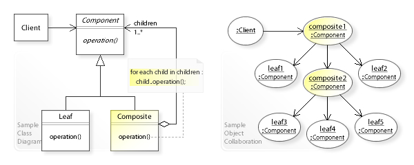
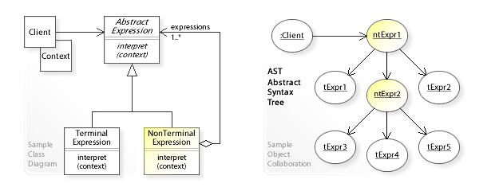
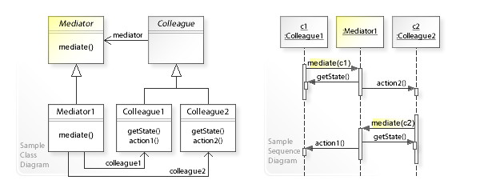

# 1. From Primitives to Frameworks
## Type, Coercion
- `typeof`: `undefined`, `boolean`, `number`, `bigint`, `string`, `symbol`, `function`, `object`
- `==`: [[MDN]](https://developer.mozilla.org/en-US/docs/Web/JavaScript/Equality_comparisons_and_sameness#Loose_equality_using), `+` [[article]](https://2ality.com/2019/10/type-coercion.html#addition-operator-(%2B)), truthy/falsy [[MDN]](https://developer.mozilla.org/en-US/docs/Glossary/Falsy)
```js
const clone = new Map();
function deepClone(obj) {
  if (typeof obj != 'object' || obj === null) return obj;
  const res = Array.isArray(obj) ? [] : {};
  clone.set(obj, res);
  for (let key of Object.keys(obj)) {
    res[key] = clone.get(obj[key]) || deepClone(obj[key]);
  }
  return res;
}
```
## OO, Prototypal Inheritance
- Meta programming - `Proxy`, `Reflect`
  - `apply`, `construct`
  - `has`, `ownKeys`, `get`, `set`, `isExtensible`, `preventExtensions`, `getOwnPropertyDescriptor`, `defineProperty`, `deleteProperty`
  - `getPrototypeOf`, `setPrototypeOf`
  ```js
  // Without using `Reflect`
  function _new(Ctor, ...args) {
    const instance = Object.create(Ctor.prototype);
    return Ctor.call(instance, ...args) || instance;
  }

  function _instanceof(obj, Ctor) {
    let cur = Object.getPrototypeOf(obj);
    while (cur) {
      if (cur === Ctor.prototype) return true;
      cur = Object.getPrototypeOf(cur);
    }
    return false;  
  }
  ```
### Array [[MDN]](https://developer.mozilla.org/en-US/docs/Web/JavaScript/Reference/Global_Objects/String#Instance_methods), Set
-
  ```js
  Array.prototype._reduce = function(callback, initialValue) {
    if (initialValue == null && this.length == 0) {
      throw new TypeError('Reduce of empty array with no initial value');
    }
    let acc = initialValue == null ? this[0] : initialValue;
    for (let i = initialValue == null ? 1 : 0; i < this.length; i++) {
      acc = callback(acc, this[i], i, this);
    }
    return acc;
  }
  ```
- Array deduplication: `[...new Set(arr)]`
- Set operations [[article]](https://exploringjs.com/impatient-js/ch_sets.html#missing-set-operations)
  ```js
  const union = new Set([...a, ...b]);
  const intersection = new Set([...a].filter(x => b.has(x)));
  const difference = new Set([...a].filter(x => !b.has(x)));
  ```
- Convert array-like (has `length` property) and iterable objects to arrays
  > `arguments` is both array-like and iterable
  ```js
  const arr = Array.from(obj) // array-like or iterable
  const arr = Array.prototype.slice.call(obj); // array-like
  const arr = [...obj] // iterable
  ```

### String [[MDN]](https://developer.mozilla.org/en-US/docs/Web/JavaScript/Reference/Global_Objects/Array#Instance_methods), Regular Expression
- Regex: [character classes](https://developer.mozilla.org/en-US/docs/Web/JavaScript/Guide/Regular_Expressions/Character_Classes), [assertions](https://developer.mozilla.org/en-US/docs/Web/JavaScript/Guide/Regular_Expressions/Assertions), [groups](https://developer.mozilla.org/en-US/docs/Web/JavaScript/Guide/Regular_Expressions/Groups_and_Ranges), [quantifiers](https://developer.mozilla.org/en-US/docs/Web/JavaScript/Guide/Regular_Expressions/Quantifiers)
  ```js
  '221234567'.replace(/\B(?=(\d{3})+$)/g, ',') // -> 221,234,567
  ```
- `String.prototype.replace` backreference: `$n`, `$<name>`, `$&` (entire match) [[MDN]](https://developer.mozilla.org/en-US/docs/Web/JavaScript/Reference/Global_Objects/String/replace#Specifying_a_string_as_a_parameter)
- `String.prototype.match(regexp)` returns:
   - Without `y`, `g` flags: `[firstMatch, [...capturingGroups], index, input, groups: { ... } ]`
   - Otherwise `[...allMatches]`
- `String.prototype.matchAll(regexp)` return an iterator of all matches.
- `RegExp.prototype.exec(str)` returns:
   - Without `y`, `g` flags: same as `String.prototype.match`
   - Otherwise is stateful (`lastIndex`), can be called repeatedly to iterate over all matches.

## Execution Context, Lexical Scope, Closure, `this` Binding [[spec]](https://es5.github.io/#x10.3)
Related: Closure in Scheme (with diagrams) [[SICP]](https://mitpress.mit.edu/sites/default/files/sicp/full-text/book/book-Z-H-21.html#%_sec_3.2)
```js
// Loop + `setTimeout` without using `let`
for (var i = 0; i < 5; i++) {
  setTimeout(j => console.log(j), 1000, i);
}

for (var i = 0; i < 5; i++) {
  (function (j) {
    setTimeout(() => console.log(j), 1000);
  })(i);
}

for (var i = 0; i < 5; i++) {
  (function () {
    var j = i;
    setTimeout(() => console.log(j), 1000);
  })();
}
```
```js
Function.prototype._bind = function(thisArg, ...args) {
  const fn = this;
  return function() {
    return fn.call(thisArg, ...args, ...arguments);
  }
}

const key = Symbol();
Function.prototype._call = function(thisArg, ...args) {
  const fn = this;
  if (!thisArg) return fn(...args);
  thisArg[key] = fn;
  const ret = thisArg[key](...args);
  delete thisArg[key];
  return ret;
}
```
- l-value and r-value [[WP]](https://en.wikipedia.org/wiki/Value_(computer_science)#lrvalue)
- Evaluation of `try-catch-finally`: [[spec]](http://www.ecma-international.org/ecma-262/11.0/index.html#sec-try-statement-runtime-semantics-evaluation)
- `eval` uses local scope if called explicitly, otherwise uses global scope.
- `with` uses prototype chain for name resolution [[spec]](http://www.ecma-international.org/ecma-262/11.0/index.html#sec-with-statement-runtime-semantics-evaluation)
- `this` **always** points to `window` in the global execution context [(spec)](http://es5.github.io/#x10.2.3) and `setTimeout`/`setInterval` callbacks.
- Use arrow functions in constructor functions or public class fields to "bind" `this` (use lexical `this`).
- Application of closures
  - Currying (converts function of arity n to functions of arity 1)
  - Partial application (i.e. `bind`, reduces arity)
  - Private variables (constructor functions)
  - Module systems, singleton
    ```html
    <head>
      <style>
        #modal {
          width: 400px;
          height: 400px;
          position: fixed;
          top: 0; bottom: 0; left: 0; right: 0;
          margin: auto;
          background: gray;
          line-height: 400px;
          text-align: center;
        }
      </style>
    </head>
    <body>
      <button id="open">open</button>
      <button id="close">close</button>
      <script>
        const getModal = (() => {
          let modal;
          return () => {
            if (!modal) {
              modal = document.createElement('div');
              modal.id = 'modal';
              modal.textContent = 'Modal Test';
              document.body.append(modal);
            }
            return modal;
          }
        })();
  
        document.getElementById('open').onclick = () => getModal().style.display = 'block';
        document.getElementById('close').onclick = () => getModal().style.display = 'none';
      </script>
    </body>
    ```
## Garbage Collection
- Reference counting (引用计数法), Tracing (mark-and-sweep (标记清除法), stop-and-copy, etc.)
- V8 GC: *most objects die young (generational hypothesis)*. [[official blog]](https://v8.dev/blog/free-garbage-collection#deep-dive-into-v8%E2%80%99s-garbage-collection-engine)
  - Young generation (新生代): **Scavenge - [semi-space (stop-and-copy)](https://www.memorymanagement.org/glossary/t.html#term-two-space-collector)**
  - Old generation (老生代): **[mark-and-sweep](https://www.memorymanagement.org/glossary/m.html#term-mark-sweep)** - incremental marking steps (~5ms), concurrent sweeper threads, [compaction (压缩)](https://www.memorymanagement.org/glossary/c.html#term-compaction)
  - Scheduled as idle tasks (e.g. after rendering and before vsync)
- Causes of memory leaks
  - Reference counting + reference cycles.
  - Global variables (accidental or intentional) - always reachable (GC root is the global object)
  - Internal references: event listeners, `setInterval`, recursive `setTimeout` [[article]](https://javascript.info/settimeout-setinterval)
    - Use `clearTimeout(id)`, `clearInterval(id)`, `removeEventListener(fn)`, 
  - Closure do not cause memory leak, unless deoptimized (e.g. by using `eval`) [[article]](https://www.smartik.net/2017/03/browsers-closures-optimization-avoiding-memory-leaks.html)
  - Problematic closure implemenation by JS engines - e.g. multiple closures sharing a parent scope [[article]](https://auth0.com/blog/four-types-of-leaks-in-your-javascript-code-and-how-to-get-rid-of-them)
  ```js
  var f = (function() {
    var a = 'some potentially very large data';
    return function() {};
  })(); // <- The entire function scope is optimized away

  var g = (function() {
    var a = 'some potentially very large data';
    function b() { console.log(a); } 
    return function() {};
  })(); // <- `b` is optimized away, but `a` survives because it's referenced by `b`! 
  ```

## Asynchronicity
### Operating System
- Threads: represented by [TCB](https://en.wikipedia.org/wiki/Thread_control_block), have separate stack pointer, program counter, registers but share memory, file descriptor table. 
- Processes: virtual memory, IPC [[WP]](https://en.wikipedia.org/wiki/Inter-process_communication)
  - Network socket, Unix domain socket
  - Message queue, anonymous pipe, named pipe
  - File, Shared memory, memory-mapped file
  - (Unix) Signal (SIGTERM, etc.)
#### Node.js Event Loop - libuv
- Uses kernel API for I/O event notifications (e.g. [`epoll`](https://en.wikipedia.org/wiki/Epoll) on Linux) [[Youtube]](https://www.youtube.com/watch?v=P9csgxBgaZ8)
  - Directly epoll-able: sockets, pipes, etc.
  - Thread pool (epoll on a pipe and write to pipe when data is ready): `fs` module, etc.
- Initialize the event loop, processes input script, then enters the event loop: 
  - Microtasks: flush `process.nextTick` queue, flush `Promise.then` queue, repeat
    - Flushed after each macrotask phase
    - **UPDATE**: As of v11, flushed after each `setTimeout`/`setInterval`/`setImmediate` callback.
  - Macrotasks: Phases
    - Timers (`setTimeout`, `setInterval`) **NOTE**: delay set to 1 if outside [1, 2147483647]. [[doc]](https://nodejs.org/api/timers.html#timers_settimeout_callback_delay_args)
    - Poll (I/O) [[official blog]](https://nodejs.org/en/docs/guides/event-loop-timers-and-nexttick/#poll) `int epoll_wait(int epfd, struct epoll_event *events, int maxevents, int timeout);`
    - Check (`setImmediate`)

### Promise - eventual result of an asynchronous operation [[Promise/A+ spec]](https://promisesaplus.com/)
- `Promise.all`, `Promise.race`, `Promise.resolve` (flattens nested thenables), `Promise.reject`
- `Promise.prototype.finally(onFinally)`, receives no args, returns a promise that resolves/rejects witht the same state

```js
class _Promise {
  constructor(executor) {
    this.status = 'pending';
    this.value = null;
    this.reason = null;
    this.callbacks = [];      
    executor(this.resolve.bind(this), this.reject.bind(this));
  }

  resolve(value) {
    if (this.status !== 'pending') return;
    this.status = 'fulfilled';
    this.value = value;
    this.callbacks.forEach(queueMicrotask);
  }

  reject(reason) {
    if (this.status !== 'pending') return;
    this.status = 'rejected';
    this.reason = reason;
    this.callbacks.forEach(queueMicrotask);
  }

  then(onFulfilled, onRejected) {
    if (typeof onFulfilled != 'function') {
      onFulfilled = value => value;
    }
    if (typeof onRejected != 'function') {
      onRejected = reason => { throw reason; };
    }
    const promise = new _Promise(() => {});
    const processResult = () => {
      try {
        this.status === 'fulfilled'
          ? resolvePromise(promise, onFulfilled(this.value))
          : resolvePromise(promise, onRejected(this.reason));
      } catch (e) {
        promise.reject(e);
      }
    }
    this.status === 'pending'
      ? this.callbacks.push(processResult)
      : queueMicrotask(processResult);
    return promise;
  }
}
```
```js
function resolvePromise(promise, x) {
  if (x === promise) {
    promise.reject(new TypeError());
  } else if (x instanceof _Promise) {
    if (x.status === 'fulfilled') {
      resolvePromise(promise, x.value)
    } else if (x.status === 'rejected') {
      promise.reject(x.reason);
    } else {
      x.then(
        value => resolvePromise(promise, value),
        reason => promise.reject(reason)
      );
    }
  } else if (typeof x == 'object' && x || typeof x == 'function') {
    let then;
    try {
      then = x.then;
    } catch (e) {
      promise.reject(e);
      return;
    }
    if (typeof then == 'function') {
      let hasCalled = false;
      try {
        then.call(
          x,
          value => {
            if (hasCalled) return;
            hasCalled = true;
            resolvePromise(promise, value)
          },
          reason => {
            if (hasCalled) return;
            hasCalled = true;
            promise.reject(reason)
          }
        );
      } catch (e) {
        if (hasCalled) return;
        promise.reject(e);
      }
    } else {
      promise.resolve(x);
    }
  } else {
    promise.resolve(x);
  }
}
```
```js
function runGenerator(generator) {
  const it = generator();
  function iterate(val) {
    let ret = it.next(val);
    if (!ret.done && ret.value instanceof Promise) {
      ret.value.then(iterate);
    }
  }
  iterate();
}
```

## Web APIs 
### `EventTarget`
- Event capturing (捕获), bubbling (冒泡), delegation (using `event.target`)
  ```js
  function bind(el, evt, fn, sel) {
    el.addEventListener(evt, e => {
      if (!sel || e.target.matches(sel)) {
        fn.call(e.target, e);
      }
    })
  }
  ```
- `this` and `e.currentTarget` point to attached element [[MDN]](https://developer.mozilla.org/en-US/docs/Web/API/EventTarget/addEventListener#The_value_of_this_within_the_handler)
- `new Event(typeArg, init)`, `EventTarget.dispatch(event)`
- ```js
  function debounce(fn, delay) {
    let timer;
    return function() {
      clearTimeout(timer);
      timer = setTimeout(() => {
        fn.apply(this, arguments);
      }, delay);
    }
  }

  function throttle(fn, interval) {
    let timer;
    return function() {
      if (!timer) {
        fn.apply(this, arguments);
        timer = setTimeout(() => {
          timer = null;
        }, interval);
      }
    }
  }

  function throttle(fn, interval) {
    let last = 0;
    return function() {
      let now = +new Date(); // Date.now(), performance.now()
      if (now - last >= interval) {
        fn.apply(this, arguments);
        last = now;
      }
    }
  }
  ```

### [Node](https://developer.mozilla.org/en-US/docs/Web/API/Node), [ParentNode](https://developer.mozilla.org/en-US/docs/Web/API/ParentNode), [ChildNode](https://developer.mozilla.org/en-US/docs/Web/API/ChildNode), [Element](https://developer.mozilla.org/en-US/docs/Web/API/Element), [HTMLElement](https://developer.mozilla.org/en-US/docs/Web/API/HTMLElement)
- `Node` interface:
  - `nodeType`: 1 (ELEMENT_NODE), 3 (TEXT_NODE), 8 (COMMENT_NODE), 9 (DOCUMENT_NODE)
  - `appendChild`, `removeChild`, `replaceChild(new, old)`, `insertBefore(new, ref)`, `cloneNode(deep = false)`
- `Document` interface:
  - `createElement`, `createTextNode`, `createAttribute`, `createComment`, `createDocumentFragment`
  - `forms`, `getElementById`, `getElementsByTagName`, `getElementsByClassName`, `getElementsByName`, `querySelector`, `querySelectorAll`
  > `document.getElementsByTagName('*')` returns all elements
```js
class jQuery {
  constructor(selector) {
    const elements = document.querySelectorAll(selector);
    for (let i = 0; i < elements.length; i++) {
      this[i] = elements[i]
    }
    this.length = elements.length;
  }
  each(fn) {
    for (let i = 0; i < this.length; i++) {
      fn(this[i]);
    }
  }
  on(evt, fn) {
    this.each(el => el.addEventListener(evt, fn));
  }
}
```
### Routing - locating views via URL
- URL hash - meant for same-page navigation (jump to `id`)
  - set: `location.hash` (other `location` properties: `href`, `protocol`, `host`, `port`, `pathname`, `search`)
  - get: `hashchange`(`window.onhashchange`) event, `e.newURL|oldURL`
  - Hash is never sent to server. Updating hash does not reload the page.
  - **DISADVANTAGE**: Search engine crawlers ignore hash to prevent reindexing the same page
- HTML5 History API
  - set: `history.pushState|replaceState(state, title, url)|forward|back|go(delta)`
  - get: `popstate` (`window.onpopstate`) event, `e.state`
  - Normal URL, better for SEO, but requires server to always return `index.html`
### Storage
- Cookies, at least 4KB max each (name, value, attributes included), 50 cookies per domain
  ```js
  document.cookie = 'key=value'; // Set one cookie
  const cookies = new Map(document.cookie.split(/\s*;\s*/).map(s => s.split('=')));
  const value = cookies.get('key');
  ```
- `localStorage|sessionStorage`, at least 5MB/10MB max per domain

## Frameworks
- [Article: Change Detection in JavaScript Frameworks](http://teropa.info/blog/2015/03/02/change-and-its-detection-in-javascript-frameworks.html)
- Abstraction & Overhead: https://github.com/atom/atom/pull/5624
### React
#### Basic Usage
```js
function Node({ data, children }) {
  const entries = Object.entries(data).filter(([, value]) => typeof value != 'object');
  return (
    <div style={{ border: '1px solid #DDD'}}>
      {entries.length ? (
        <section style={{ background: '#EEE', margin: 10, padding: 10 }}>
          {entries.map(([key, value]) => <p key={key}>{key} - {JSON.stringify(value)}</p>)}
        </section>
      ) : null}
      {children}
    </div>
  )
}

function Tree({ data }) {
  const children = Object.entries(data).filter(([, value]) => typeof value == 'object');
  return (
    <Node data={data}>
      {children.map(([key, value]) => (
        <section key={key} style={{ margin: 30 }}>
          <h5>{key}</h5>
          <Tree data={value} />
        </section>
      ))}
    </Node>
  );
}
```
- JSX (`{JS expression}`) -> `React.createElement(type, [props], [...children])` [[docs]](https://reactjs.org/blog/2015/12/18/react-components-elements-and-instances.html)
- `SyntheticEvent` - cross-browser compatibility
  - **Event delegation**: Native events bubble to `document` -> event pooling -> `dispatchEvent`
  > **UPDATE**: no more pooling in v17 [[official blog]](https://reactjs.org/blog/2020/08/10/react-v17-rc.html#no-event-pooling)
  - `e.nativeEvent.currentTarget === document`, `this === undefined`
  - **IMPORTANT**: `SyntheticEvent`s are nullified after callbacks are invoked, therefore can't be accessed asynchronously.
- DOM elements, forms:  [[docs]](https://reactjs.org/docs/dom-elements.html), [[docs]](https://reactjs.org/docs/forms.html)
  -  `htmlFor`, `className`, `style` (object), `dangerouslySetInnerHTML` (`{ __html }`)
  - Controlled components
    - `value`(input/textarea/select) or `checked`(radio/checkbox) (DOM properties instead of attributes)
    - `onChange` (`input` instead of `change` event)
  - Uncontrolled components (e.g. file input)
    - `defaultValue`, `defaultChecked` (correspond to `value`, `checked` attributes)
    - `React.createRef()` -> `ref={this.someRef}` -> `this.someRef.current`
- Props: *lift shared state up*, *HOC*, *render prop*, typecheck with `prop-types` [[docs]](https://github.com/facebook/prop-types).  
- **`setState(updater, callback)`** [[docs]](https://reactjs.org/docs/react-component.html#setstate)
  - Enqueue updates to be merged during reconcilliation [[source code]](https://github.com/facebook/react/blob/15-stable/src/renderers/shared/stack/reconciler/ReactCompositeComponent.js#L894)
  - [Why is `setState` asynchronous](https://github.com/facebook/react/issues/11527)
  - [When is `setState` batched (asynchronous)](https://stackoverflow.com/questions/48563650/does-react-keep-the-order-for-state-updates/48610973#48610973)
    - Batched in React event handlers, lifecycle hooks
    > Transaction (Implementation Detail): `isBatchingUpdates = true` -> `someMethod()` -> `isBatchingUpdates = false`
    - Otherwise (`setTimeout`, `addEventListener`, `Promise.then` etc.) flushed immediately
    - **NOTE**: This is an implementation detail and will change in later versions [[GitHub]](https://github.com/facebook/react/issues/10231#issuecomment-316644950) [[official blog]](https://reactjs.org/docs/concurrent-mode-adoption.html#feature-comparison)
    > Legacy mode has automatic batching in React-managed events but it’s limited to one browser task. Non-React events must opt-in using unstable_batchedUpdates. In Blocking Mode and Concurrent Mode, all setStates are batched by default.
    chingUpdates == false`
- `React.createContext` -> `Context.Provider` -> (`Context.Consumer` + render prop) or (`static contextType` + `this.context`)
- `ReactDOM.createPortal(child, container)`
- Async components - `React.lazy`,  `React.Suspense` 

#### Reconciliation [[docs]](https://reactjs.org/docs/reconciliation.html), Optimizations
- **React Fiber** - incremental rendering [[article]](https://github.com/acdlite/react-fiber-architecture)
> - A fiber corresponds to a stack frame, but it also corresponds to an instance of a component.
> - Conceptually, the type (of a React element or fiber) is the function (as in v = f(d)) whose execution is being tracked by the stack frame.
> - Conceptually, props are the arguments of a function.
- **Lifecycle Hooks** [[diagram]](https://projects.wojtekmaj.pl/react-lifecycle-methods-diagram/)
  - If using `createReactClass`, `getDefaultProps`/`getInitialState` [[docs]](https://reactjs.org/docs/react-without-es6.html#declaring-default-props) (With ES6 classes, use  `static defaultProps` and set initial state in constructor instead)
  - `static getDerivedStateFromProps`
  - ~~`componentWillMount`~~
  - `componentDidMount`
  - ~~`componentWillReceiveProps(nextProps)`~~
  - `shouldComponentUpdate(nextProps, nextState)`
  - ~~`componentWillUpdate(nextProps, nextState`)~~
  - `getSnapshotBeforeUpdate(prevProps, prevState)` - Return value will be passed to `componentDidUpdate`
  - `componentDidUpdate(prevProps, prevState, snapshot)`
  - `componentWillUnmount` - Clean up timers, ongoing requests, subscriptions here
- `React.memo(functionalComponent[, areEqual])` shallow-compares props.
- **`shouldComponentUpdate(nextProps[, nextState])`** returns `true` by default.
- `PureComponent` implements SCU with a *shallow* (deep is expensive) comparison of props and state.

#### Redux [[docs]](https://redux.js.org/api/api-reference)
- **Unidirectional data flow (单向数据流)** [[diagrams]](https://github.com/reduxjs/redux/issues/653#issuecomment-216844781)
- `createStore(reducer, applyMiddleware(thunk))`, `store.dispatch(action)`, `store.subscribe(() => { store.getState() })`
- Redux Thunk: `store.dispatch((dispatch) => { })`;
- React Redux: `<Provider store={store}>`, `connect(mapStateToProps, mapDispatchToProps)(Component)` [[Gist]](https://gist.github.com/gaearon/1d19088790e70ac32ea636c025ba424e)
#### React Router
- `HashRouter`, `BrowserRouter` (HTML5 history API)
- `<Route path="..."><A/></Router>`, `Switch` renders only the first matching, `<Link to="..."></Link>`
- Hooks (functional components): `useParams()`, `useHistory()`, etc. 
- Route props: `match`, `location`, `history` [[docs]](https://reactrouter.com/web/api/Route/route-props)
- Route-based code splitting (lazy loading) [[React docs]](https://reactjs.org/docs/code-splitting.html#route-based-code-splitting)

### Vue
#### Template, Render Function
- Template compiles to (`{ render: function(createElement) { with(this) { ... }  } }`), at runtime or AoT using webpack + `vue-loader`
- **`a {{expression}} b`** -> `_v("a " + _s(expression) + " b")`
- **`v-show="boolExpr"`** -> CSS `display: none` if false.
- **`v-if="aExpr"`, `v-else-if="bExpr"`, `v-else`** -> `(aExpr) ? _c(...) : (bExpr) ? _c(...) : _c(...)`
- **`v-for` + `v-bind:key`**
  - **`v-for="(item, index) in list"`** -> `_l((list), function(item, index) { ... })`
  - **`v-for="(value, name, index) in obj"`** -> `_l((obj), function(value, name, index) { ... })`
  - **Caveat**: Don't use `v-if` on the same tag as `v-for`: `v-for` has higher precedence, `v-if` will be repeated
- Props: **`v-bind:`, `:`**
  - Prop declaration, validation
    - **`{ props: ['aProp', ... ] }`** 
    - **`{ props: { aProp: SomeType, ... } }`**
    - **`{ props: { aProp: { type, required, default }, ... } }`**
  - **`:name="expression"`** -> `{ attrs: { "name": expression }}`
  - **`:class="[aClass, bClass]"`** or **`:class="{aClass: aBool}"`**
  - **`:style="{key: val}"`**
- Events: **`v-on:`, `@`** 
  - **`@event="method"`** -> `{ on: { "event": method } }` 
  - **`@event="[...statements]"`** -> `{ on: { "event": function($event) { [...statements] } }}`
  - Native events: *attached to each DOM node, no delegation*
    - **`@event.modifier="method"`** -> `{ on: { "event": function($event) { if (...) return null; return method($event) } }}`
    - Event modifiers: `.stop`, `.prevent`, `.capture`, `.self` (only when `event.target == event.currentTarget`)
    - Key modifiers: `.ctrl`, `.shift`, `.enter`, `.space`, `.up`, ..., `.exact`
  - Custom events: `@a-event="..."` + **`this.$emit('a-event', ...args)`**
  - Use Vue instance (e.g. `new Vue()`) as *event bus*: **`vm.[$on|$off](eventName, callback)`, `vm.$emit(eventName, ...args)`**
- **`v-model="name"`** -> `{ domProps: { "value": (name) }, on: { "input": function($event) { ... name = $event.target.value } } }`
  - Modifiers: `.lazy` (sync on `change`), `.trim` -> `$event.target.value.trim()`, `.number` -> `_n($event.target.value)`
  - Custom `v-model`: **`{ model: { prop, event }}`**
- **`<slot>`** - compare React *children, render prop*
  - Named (具名插槽): **`<slot name="aName">` + `<template v-slot:aName>`**
  - Scoped (作用域插槽): **`<slot :aProp="aVal">` + `<template v-slot:default="allProps">`**
  - `<template v-slot:name="slotProps">` ->  `{ scopedSlots: _u([{ key: "name", fn: function(slotProps) { ... } }]) }`
- Dynamic component: **`<component :is="a-comp"/>`** -> `_c(a-comp, { tag: "component" })`
- Async component: **`{ components: { aComp: () => import('path/to/module') } }`**
- **`ref="a"`, `this.$refs.a`**
- **`v-html`**
- **`{ mixin: [mixinA, mixinB] }`**

#### Reactivity
- **`data: function() { return {...} }`**
- **computed properties (计算属性)**: **`computed: { a() {}, b: { get() {}, set(){} } }`** - values are cached.
- **watchers (侦听器)**: **`watch: { a(val, oldVal) {}, 'aExpr': ['aMethod', { handler(val, oldVal) {}, deep: true }, ...] }`**
  - **Caveat**: For updates in nested objects, `oldVal == newVal`
- **Implementation (v2)**: 
  - `Observer` associates each property to a `Dep` instance to manage subscription
  - `Watcher` (one for each component) runs render function after setting `Dep.target` to itself.
  - Issues with `Object.defineProperty` -> Vue 3 uses `Proxy`/`Reflect` API
    - Traversal of properties is expensive
    - Cannot detect property addition/deletion
      - Use `Vue.set(target, key, value)`/`Vue.delete(target, key)`
    - Disabled for arrays (setting items by index, setting `length`) due to performance concerns [[GitHub]](https://github.com/vuejs/vue/issues/8562#issuecomment-408292597)
      - **Implementation**: Array methods are overriden by extending `Array.prototype`
      - Use **`arr.splice(i, 1, newValue)`** to set item
- **Lifecycle**: `constructor`, `beforeCreate`, `created`, `beforeMount`, `mounted`, `beforeUpdate`, `updated`, `beforeDestroy`, `destroyed`
  - `<keep-alive>` (caching) -> additional lifecycles :`activated`/`deactivated`
- **`this.$nextTick`/ `Vue.nextTick`**
  ```js
  function nextTick(cb, ctx) {
    let _resolve
    callbacks.push(() => {
      if (cb) {
        /* ... */
        cb.call(ctx)
        /* ... */
      } else if (_resolve) {
        _resolve(ctx)
      }
    })
    if (!pending) {
      pending = true
      // Schedule `flushCallbacks` using `Promise.then`, `MutationObserver`, `setImmediate`, or `setTimeout`
      timerFunc() 
    }
    if (!cb && typeof Promise !== 'undefined') {
      return new Promise(resolve => {
        _resolve = resolve
      })
    }
  }
  ```
### Vuex
- `new Vuex.Store({  state,  getters, mutations,  actions, modules })`
- `store.commit(mutationType, payload)`, `store.dispatch(actionType, payload)`
- component binding helpers: [`mapState`](https://vuex.vuejs.org/guide/state.html#the-mapstate-helper), [`mapGetters`](https://vuex.vuejs.org/guide/getters.html#the-mapgetters-helper), [`mapMutations`](https://vuex.vuejs.org/guide/mutations.html#committing-mutations-in-components), [`mapAction`](https://vuex.vuejs.org/guide/actions.html#dispatching-actions-in-components)
### Vue Router
- `new VueRouter({ mode: 'hash'|'history'|'abstract', routes: [ { path: '/some/path/:id', component: A|() => import('./b')} ] })`
- `<router-link to="/path">`, `<router-view>`, `this.$route.params.id`, `this.$router.push|replace|go`

## HTTP
### Data Link, Network, Transport, Session Layers
- Switch - data link layer, MAC address
- Router - network layer, IP address
- UDP - *connectionless, unreliable* transport, minimum overhead.
- TCP - *connection-oriented, reliable* transport
  - **3-way handshake**: SYN(seq=x), SYN-ACK(seq=y, ack=x+1), ACK(seq=x+1, ack=y+1)
  - **4-way termination**: FIN(seq=x, ack=y), ACK(seq=y, ack=x+1), FIN-ACK(seq=z, ack=x+1), ACK(seq=x+1, ack=z+1)
  - **Reliable Transmission**: *sequence number* (序列号) for each byte, *acknowledgement* (确认应答), *retransmission (timeout/dupacks)*
  - **Error Detection**: checksum (检验和) header
  - **Flow Control**: window size header
  - **Congestion Control**: slow-start, congestion avoidance, fast retransmit (3 duplicate ACKs), fast recovery (TCP Reno skips slow start) 
- TLS (RSA) handshake [[article]](https://www.cloudflare.com/learning/ssl/what-happens-in-a-tls-handshake/): 
  - "client hello" (supported TLS version/cipher suites, "client random")
  - "server hello" (selected version/cipher suite, "server random", server SSL certificate with server public key and CA signature)
  - Client verifies server certificate using CA public key, sends "premaster secret" encrypted with server public key, server decrypts.
  - Client and server both generate session keys and send an encrypted "finished" messages to each other.
### HTTP
#### Versions
- HTTP/1.0  
  - Cannot reuse TCP connection unless `Connection: keep-alive`.
  - Parallel requests suffer **head-of-line blocking** (HOL, 队头阻塞) due to limit of 6 connections per hostname
- HTTP/1.1  
  - Uses **persistent connection** (长连接) by default, thus avoids the overhead of TCP handshake and slow start
  - Within one connection each request needs to wait until previous response is received -> HOL. 
  - **Pipelining** (管线化) - no waiting for responses, but responses still need to be processed in order -> still HOL
- HTTP/2 [[article]](https://hpbn.co/http2/)  
  - **Binary framing layer** (二进制分帧层) - faster parsing than text-based
  - **Header compression** [[spec]](https://tools.ietf.org/html/rfc7541#section-6)
  - **Multiplexing** (多路复用) (streams, messages, frames) - *concurrency solves HOL in HTTP*, but TCP still has HOL [[article]](https://community.akamai.com/customers/s/article/How-does-HTTP-2-solve-the-Head-of-Line-blocking-HOL-issue?language=en_US)
  - **Stream prioritization** (weight and dependency)
  - **Flow control** (流量控制)
  - **Server push** (to HTTP cache) - replaces assets inlining (JS, CSS, images data URL)
- HTTP/3: uses UDP, QUIC
#### Methods
- GET/PUT/DELTE are *idempotent* (幂等), POST is not (`POST /collection` v.s. `PUT /collection/12345`) [[StackOverflow]](https://stackoverflow.com/a/45019073) 
- OPTIONS (check allowed request methods, CORS preflight), CONNECT (HTTP tunneling, forward *TCP* connection)
#### Status Codes
*1xx (informational) ,2xx (successful), 3xx (redirects), 4xx (client errors), 5xx (server errors)*
  - *200 OK, 301 Moved Permanently, 302 Found (Moved Temporarily), 304 Not Modified, 307 Temporary Redirect*
  - *400 Bad Request (e.g. request syntax error), 401 Unauthorized, 403 Forbidden (e.g. not authorized), 404 Not Found*
  - *500 Internal Server Error, 502 Bad Gateway, 504 Gateway Timeout*
#### Headers [[MDN]](https://developer.mozilla.org/en-US/docs/Web/HTTP/Headers)
- **Context, Content, Range, Redirect**: `Date`, `From` (email address), `Host`, `Referer`, `User-Agent`, `Accept` (content type), `Accept-Charset`, `Accept-Encoding` (compression), `Accept-Language`, `Range`, `Server`, `Accept-Ranges` (server), `Content-Length`, `Content-Type`, `Content-Encoding`, `Content-Language`, `Content-Range`, `Location` (redirects)*
- **Caching**: `Cache-Control`, `Expires`, `Last-Modified`, `ETag`, `If-(None)-Match`, `If-(Un)Modified-Since`, `Age` (proxy cache)
  -  `Cache-Control`: `public`, `private`, `no-cache` (always validate), `no-store`, `max-age=<seconds>`, `s-maxage=<seconds>`
  - 301 cacheable by default, 302/307 not cacheable unless `Cache-Control`/`Expires` is set
  - Chrome: Blink in-memory cache [[doc]](https://developer.chrome.com/extensions/webRequest#caching) [[StackOverflow]](https://stackoverflow.com/questions/52950068/what-does-blink-in-memory-cache-store) -> service worker `cache.match(event.request)` -> disk cache
- **Cookies**: `Cookie`, `Set-Cookie` [[MDN]](https://developer.mozilla.org/en-US/docs/Web/HTTP/Headers/Set-Cookie)
  - Attributes: `Expires`, `Max-Age`, `Domain`, `Path`, `Secure` (only over HTTPS), `HttpOnly` (not exposed to JS), `SameSite` (prevent CSRF)
  - Store state on client side -> cookie, on server side -> session + session ID cookie
- **CORS**: `Origin`, `Access-Control-Request-Headers|Method`, `Access-Control-Allow-Origin|Credentials|Headers|Methods`
  - **Same-origin policy (protocol, host, port)**
    - JSONP, reverse proxy
    - Set `document.domain = <superdomain>` (automatically sets port to null) on both parent and child frames to enable access
    - `targetWindow.postMessage(message, targetOrigin)` - sent only if `targetOrigin` matches the origin of `targetWindow` (or `*`).
  - Simple requests [[MDN]](https://developer.mozilla.org/en-US/docs/Web/HTTP/CORS#Simple_requests): `Origin` -> `Access-Control-Allow-Origin`
  - Preflighted: `OPTIONS` + `Access-Control-Request-*` -> `Access-Control-Allow-*` -> request
- **Authentication**: `WWW-Authenticate`, `Authorization`
  - HTTP Basic Authentication
    - 401 Unauthorized + `WWW-Authenticate: Basic` (browser automatically prompts for credentials)
    - `Authorization: Basic base64(<username>:<password>)` sent every time.
  - Session & Cookie: Log in with username/password -> session -> session ID cookie.
  > To send credential (cookies, basic auth), set `XMLHttpRequest.withCredentials = true` or use `{ credentials: 'include' }` with fetch.
  - Token-based authentication - stateless (no session), scalable 
    - Login with username/password -> server issues *signed* JWT -> saved in `localStorage`/`sessionStorage`
    - Client *explicitly* attaches `Authorization: Bearer <JWT token>` to every request -> *prevents CSRF*
    - Server validate signature, check *scopes (permissions)*
  - OAuth (开放授权) 2.0 -> OpenID Connect [[spec]](https://openid.net/specs/openid-connect-core-1_0.html#Authentication)
- **Security**: `Content-Security-Policy`, `X-Frame-Options` 
  - **CSRF** (跨站请求伪造): exploits authentication automatically provided by browser (cookie, basic auth, etc)
    - Set cookie attribute `SameSite=Strict`
    - Send CSRF token with requests, validate token on server
      - `<input type="hidden" name="csrf-token" value="<csrf-token>">`
      - Set CSRF cookie -> send CSRF token in *custom header* (cross-origin will need preflight)
    - *XSS defeats all CSRF preventions* 
  - **XSS** (跨站脚本攻击): injects inline scripts
    - Sanitize input characters (also applies to SQL injection, OS command injection, etc.)
    - Block all inline scripts `Content-Security-Policy: script-src 'self' <source> ...` [[MDN]](https://developer.mozilla.org/en-US/docs/Web/HTTP/Headers/Content-Security-Policy/script-src)
  - **Clickjacking** (点击劫持): hidden iframe (bottom + `pointer-events: none`, top + transparent)
    - `Content-Security-Policy: frame-ancestors 'none'|'self'|<source>`, `X-Frame-Options: DENY|SAMEORIGIN`
    - `SameSite=Strict|Lax` cookies are not sent when loading frames (cross-site subrequest)
- **WebSocket Handshake** [[MDN]](https://developer.mozilla.org/en-US/docs/Web/API/WebSockets_API/Writing_WebSocket_servers)
  ```
  GET /chat HTTP/1.1
  Upgrade: websocket
  Connection: Upgrade
  Sec-WebSocket-Key: <...>
  Sec-WebSocket-Version: 13

  HTTP/1.1 101 Switching Protocols
  Upgrade: websocket
  Connection: Upgrade
  Sec-WebSocket-Accept: base64(sha1(<Sec-WebSocket-Key> + "258EAFA5-E914-47DA-95CA-C5AB0DC85B11"))
  ```

### API
#### XMLHttpRequest
- `progress` event (upload, download) - `e.loaded`, `e.total`
- `XMLHttpRequest.abort`, `abort` event
```js
function post(url, data = null) {
  return new Promise((resolve, reject) => { 
    const xhr = new XMLHttpRequest(); // 0 - UNSENT
    xhr.open('POST', '/api', true); // 1 - OPENED
    xhr.setRequestHeader('Content-Type', 'application/json; charset=utf-8');
    xhr.onreadystatechange = function () {
      if (xhr.readyState == 4) { 
        if (xhr.status >= 200 && xhr.status < 300) {
          resolve(JSON.parse(xhr.responseText));
        } else {
          reject(xhr.statusText);
        }
      }
    }
    xhr.send(JSON.stringify(data)); // 2 - HEADERS_RECEIVED, 3 - LOADING, 4 - DONE
  })
}
```
#### Fetch
- Promise-based, can't track request progression
```js
const controller = new AbortController();
const signal = controller.signal;
fetch(url, { signal }).catch(e => {
  if (e.name == 'AbortError') {
    console.log(e.message);
  } else {
    throw e;
  }
});
controller.abort();
```
```js
function myFetch(url) {
  return fetch(...arguments).then(res => res.ok ? res : Promise.reject(res));
}
```

#### Axios [[GitHub]](https://github.com/axios/axios)
*config -> request interceptors -> request transformers -> [adapter](https://github.com/axios/axios/tree/master/lib/adapters#axios--adapters) -> response transformers -> response interceptors -> response/error*
```js
// https://github.com/axios/axios#request-config
axios({
  method, url, baseURL, params, paramsSerializer, headers, data, responseType, transformRequest, transformResponse,
  timeout, validateStatus, cancelToken, onUploadProgress, onDownloadProgress,
  auth, proxy, withCredentials, xsrfCookieName, xsrfHeaderName,
})
```
- **Defaults** [[Source Code]](https://github.com/axios/axios/blob/master/lib/defaults.js)
  - `adapter`: Uses `XMLHttpRequest` for browser, `http.ClientRequest` for Node.js
  - `transformRequest`: Transform data and set `Content-Type` header based on type of data
  - `transformResponse`: Try to parse data as JSON if it's string
  - `validateStatus`: Reject promise if status is not 2xx
  - `xsrfCookieName`, `xsrfHeaderName`: Built-in XSRF prevention
- **`axios(config)`**, `axios.request(config)`, `axios(url, config)` (GET)
- **`axios.get|delete|head|options(url, config)`**, **`axios.post|put|patch(url, data, config)`**
- **`instance = axios.create(config)`**, **`instance.<methods>(...)`**
- **`axios.defaults.<option>`**, **`instance.defaults.<option>`**
- **`axios.interceptors.request|response.use(config|response => {}, error => {})`**

# 2. From Rendering to Building
## CSS
### Units, Responsive Web Design
- `px` (CSS), `em`, `rem`, `vw/vh/vmin/vmax`
- `window.devicePixelRatio` - physical resolution/CSS resolution, i.e. CSS pixel size/physical pixel size
- **layout viewport, visual viewport, ideal viewport** [[Visualization]](https://www.quirksmode.org/mobile/viewports/) [[YouTube]](https://www.youtube.com/watch?v=CKVFKyHl_Ag) 
  - `screen.width` -> ideal viewport, `window.innerWidth` -> layout viewport
  - `<meta name="viewport" content="...">` [[article]](https://www.quirksmode.org/mobile/metaviewport/)
    - If `scale` is set, `layoutViewportWidth = visualViewportWidth = idealViewportWidth / scale`
    - If `width` is also set, `layoutViewportWidth = max(visualViewportWidth, width)` 
  - Media query (媒体查询): `@media only screen and (...) { ... }` 
    - `min|max-width: <width>` - *layout viewport* width
    - `min|max-device-width: <width>` - *ideal viewport* width
#### How to set border to 1 *physical* pixel
- Set `initial|min|max-scale` to `1 / window.devicePixelRatio`
- Set `data-device` attribute to `window.devicePixelRatio`, and 
  ```css
  /* 1 */
  #container[data-device="2"] { 
    border: 0.5 px solid #333; /* has compatibility issues*/
  }
  
  /* 2 */
  #container {
    position: relative;
  }
  #container[data-device="2"]::after{
    content: "";
    position: absolute;
    top: 0;
    left: 0;
    box-sizing: border-box;
    width: 200%;
    height: 200%;
    border: 1px solid #333;
    transform-origin: left top;
    transform: scale(0.5);
  }
  ```
### Cascade Algorithm
  1. **Origin and Importance**: *user agent -> user -> author -> author important -> user important -> user-agent important* [[MDN]](https://developer.mozilla.org/en-US/docs/Web/CSS/Cascade#Cascading_order) 
  2. **Specificity**: *inline ? -> # ID selectors -> # class/attribute selectors, pseudo-classes -> # element selectors, pseudo-elements*
  3. **Source Order**: Later rules overrides earlier ones
### Inheritance
- Inherited properties (mostly related to text and speech): [[StackOverflow]](https://stackoverflow.com/a/5612360/10827418)
- **NOTE**: `line-height` inheritance: *lengths, unitless numbers* use original value, *percentages* use *computed value*.
### Absolute positioning
- `position: fixed` - relative to initial containing block or the first ancestor that has `transform` (or `perspective`, `filter`) set
- `left|right|top|bottom: auto` - positioned as if it is static [[MDN]](https://developer.mozilla.org/en-US/docs/Web/CSS/top)
- `width|height: auto` will be set to *shrink-to-fit*
- `display` will be implicitly set to `block`
### Centering
- Block-level (horizontal): **`margin: auto`** (self)
- Inline: **`line-height: <height>` + `text-align: center`** (parent)
- Abosolute positioning (`position: absolute`, parent `position: relative`)
  - **`left|right: 0`** (any fixed number) + **`top|bottom: 0`** (any fixed number) + **`margin: auto`** [[W3C spec]](https://drafts.csswg.org/css-position/#abspos-margins)
  - **`left: 50%; top: 50%`** + **`transform: translate(-50%, -50%)`**
  - **`left: 50%; top: 50%`** + **`margin-left: -<width>/2; margin-top: -<height>/2`** (*negative margins: T/L pulls self, B/R pulls neighbor*)
- Flexbox: **`display: flex; align-items: center; justify-content: center;`** (parent)
- Table layout: `display: table-cell; text-align: center; vertical-align: middle` (parent) + `display: inline-block` (self) 
### FLow Layout
- `<display-outside>`[[MDN]](https://developer.mozilla.org/en-US/docs/Web/CSS/display-outside) (`block`, `inline`) [[MDN]](https://developer.mozilla.org/en-US/docs/Web/CSS/CSS_Flow_Layout/Block_and_Inline_Layout_in_Normal_Flow), `<display-inside>`[[MDN]](https://developer.mozilla.org/en-US/docs/Web/CSS/display-inside) (`flow`, `flex`, `grid`, etc.)
  - `display: inline-block` is equivalent to `display: inline flow-root`
- **[Block formatting context (BFC)](https://developer.mozilla.org/en-US/docs/Web/Guide/CSS/Block_formatting_context)**
  - Created by setting *`float`,`position` (`absolute`, `fixed`), `overflow` (not `visible`), `display` (`flow-root`, `inline-block`)*
  - Usage: *contain internal floats (**"clearfix"**), exclude external floats, suppress [margin collapsing](https://developer.mozilla.org/en-US/docs/Web/CSS/CSS_Box_Model/Mastering_margin_collapsing
  )*
    ```css
    /* 1 - Create new BFC */
    .clearfix { overflow: hidden; }
    .clearfix { display: flow-root; }
    /* 2 - Pseudo-element */
    .clearfix::after { content: ''; display: block; clear: both; }
    ```
### Flex Layout
- Flex container
  - `flex-direction: row|column(-reverse)`, `flex-wrap: nowrap|wrap`, `flex-flow: <direction> <wrap>`
  - **`justify-content: (flex-)start|(flex-)end|center|space-between|space-around|space-evenly`**, `align-content` (no effect if single line).
  - **`align-items: (flex-)start|(flex-)end|center|stretch`**
- Flex item
  - **`flex-grow`**, **`flex-shrink`**(*multiplied by flex base size* when distributing negative space [[W3C spec]](https://drafts.csswg.org/css-flexbox-1/#valdef-flex-flex-shrink)), **`flex-basis`**
  - **`flex: <flex-grow> <flex-shrink> <flex-basis>`**, `initial` (`0 1 auto`), `auto` (`1 1 auto`), `none` (`0 0 auto`)
  - `order`, `align-self`
### Float 3-Column Layout
```html
<!-- 圣杯布局 -->
<div id="header"></div>
<div id="container">
  <div id="center" class="column"></div>
  <div id="left" class="column"></div>
  <div id="right" class="column"></div>
</div>
<div id="footer"></div>
```
```css
#container { width: 100%; padding: 0 200px; }
.column { float: left; }
#center { width: 100%; }
#left { margin-left: -100%; position: relative; right: 200px; width: 200px; }
#right { width: 200px; margin-right: 200px; }
#footer { clear: both; }
```
```html
<!-- 双飞翼布局 -->
<div id="container" class="column">
  <div id="main"></div>
</div>
<div id="left" class="column"></div>
<div id="right" class="column"></div>
```
```css
#container { width: 100%; }
.column { float: left; }
#main { margin: 0 200px; }
#left { margin-left: 100%; width: 200px; }
#right { margin-left: 200px; width: 200px; }
```

## Web Performance
### First Meaningful Paint (FMP),  Time to Interactive (TTI)
- Reduce **latency**: CDN - pull (reverse proxy with caching), push (upload)
- Reduce **file size**: minification, file compression (e.g. GZip)
- Reduce **number of requests**: HTTP cache, inline/concatenate resources, server-side rendering (SSR), avoid CSS `@import`
- *CSS is render-blocking* -> **Put CSS at the top, load as soon as possible** -> Reduce FMP
  - CSS itself is not parser-blocking, but it blocks scripts which block HTML parsing
- *JS is parser-blocking* -> **Put JS at the bottom, or use `defer`/`async`** -> Reduce FMP
- **Run script on `DOMContentLoaded` not `load` (all resources loaded)** -> Reduce TTI
- **Loading resources (data/code) asynchronously** -> Reduce TTI
  - Load JS modules using dynamic `import()`
  - Lazy-load images (e.g. when bottom is reached: `scrollHeight - scrollTop == clientHeight`)

### Critical Rendering Path [[article]](https://bitsofco.de/understanding-the-critical-rendering-path/)
- Optimize selectors, remove unused ones [[article]](https://csswizardry.com/2011/09/writing-efficient-css-selectors/) [[article]](https://stackoverflow.com/a/3851754/10827418)
- Debounce/throttle events, reduce DOM operations -> Reduce **reflow, repaint**
- Avoid **forced synchronous layout** (*reflow and repaint are asynchronous by default*)
  - Caused by reading DOM geometry properties and `window.getComputedStyle(el)` *while there are queued DOM changes*
    - *Geometry properties: `[offset|scroll|client]-[Top|Left|Width|Height]`* [[article]](https://javascript.info/size-and-scroll#geometry)
  - Batch style reads and do them first [[article]](https://developers.google.com/web/fundamentals/performance/rendering/avoid-large-complex-layouts-and-layout-thrashing#avoid_forced_synchronous_layouts)

## Build Tools/Process
### Babel
plugins, presets (`@babel/preset-env`, `@babel/preset-react`, etc.)
#### `@babel/preset-env`
  - polyfill (`core-js` + `regenerator-runtime`): `{ "useBuiltIns": "usage"|"entry", "corejs": "3.x" }` [[GitHub]](https://github.com/zloirock/core-js#babel)
  - `@babel/runtime` + `@babel/plugin-transform-runtime` (transforms built-ins to imports -> no global namespace pollution)
  - Always use `{ "modules": false }` (keeping ESM syntax) when used with webpack
### CSS Processing
- Preprocessors - Sass, LESS, etc.
  - *programmability, code reuse, code organization* (variables, mixins, functions, modules, etc), 
  - *readability* (e.g. nested rules)
- PostCSS plugins: Autoprefixer [[GitHub]](https://github.com/postcss/autoprefixer),  postcss-preset-env [[GitHub]](https://github.com/csstools/postcss-preset-env), CSS Modules [[GitHub]](https://github.com/css-modules/css-modules), stylelint [[docs]](https://stylelint.io/)

### Webpack [[docs](https://webpack.js.org/configuration)]
#### Initialize using config file and command-line args, apply plugins
- Use `webpack.[common|prod|dev].js` and webpack-merge [[GitHub]](https://github.com/survivejs/webpack-merge)
- **Plugins**: *tapping into the entire compilation lifecycle, using hooks provided by `Tapable`'s [[GitHub]](https://github.com/webpack/tapable)*
#### Find entries (`entry`), resolve module, resolve loader
- `(resolve|resolveLoader).alias|modules|mainFields|mainFiles|extensions` [[docs]](https://webpack.js.org/concepts/module-resolution/#module-paths)
#### Load module, parse and find dependencies, recurse for each dependency
- **Loaders**: *transformations that are applied to the source code of a module* - *transpilation, linting (代码校验)*
  - Scripts - *eslint-loader -> babel-loader (`cacheDirectory` [[docs]](https://github.com/babel/babel-loader))*
  - Stylesheets - *sass-loader/less-loader/postcss-loader -> css-loader -> style-loader*
  - Images - *url-loader (base64-encode small images) -> file-loader*
  - Vue (single-file components) - *vue-loader*
  - *thread-loader* - multiple parallel (并行) node.js processes [[docs]](https://webpack.js.org/loaders/thread-loader/) (alternative to *HappyPack plugin* [[GitHub]](https://github.com/amireh/happypack))
- `module.noParse` [[docs]](https://webpack.js.org/guides/shimming/#other-utilities)
- IgnorePlugin (Ignore `import`/`require` requests) [[docs]](https://webpack.js.org/plugins/ignore-plugin/)
- DllPlugin/DllReferencePlugin (动态链接库): [[docs]](https://webpack.js.org/plugins/dll-plugin/) [[example: DllPlugin]](https://github.com/webpack/webpack/tree/master/examples/dll), [[example: DllReferencePlugin]](https://github.com/webpack/webpack/tree/master/examples/dll-user)  
#### Traverse the dependency graph, group modules into chunks and optimize (with plugins)
- **Code splitting** (代码分割)
  - Multiple entries, `output.filename = '[name].bundle.js'`
  - `import()`, `output.chunkFilename = '[name].bundle.js'`
  - `optimization.splitChunks` [[defaults]](https://webpack.js.org/plugins/split-chunks-plugin/#optimizationsplitchunks) (by default only for async chunks)
  - MiniCSSExtractPlugin [[docs]](https://webpack.js.org/plugins/mini-css-extract-plugin/), OptimizeCssAssetsPlugin [[docs]](https://webpack.js.org/plugins/mini-css-extract-plugin/#minimizing-for-production)
- **Use `mode: 'production'` (v4+) activates built-in optimizations**
  - Sets `process.env.NODE_ENV: 'production'` using DefinePlugin [[docs]](https://webpack.js.org/guides/production/#specify-the-mode), dead code gets removed during minification
  - `optimization.minimize: true` - **Minification** using TerserPlugin (*default `parallel: true`*) [[docs]](https://github.com/webpack-contrib/terser-webpack-plugin#parallel)
  - `optimization.usedExports: true` - **Tree shaking** [[docs]](https://webpack.js.org/guides/tree-shaking/#conclusion)
  - `optimization.concatenateModules: true` - **Module concatenation ('scope hoisting')** (模块合并) [[docs]](https://webpack.js.org/plugins/module-concatenation-plugin)
    - **NOTE**: Both tree shaking and module concatenation depend on the *static structure of ES2015 module syntax*.
      - Disable transformation of ES modules syntax in Babel
      - Prioritize `'module`/`jsnext:main'` [[article]](https://github.com/rollup/rollup/wiki/pkg.module) in `resolve.mainFields`
#### Generate code and output file for each chunk
- HtmlWebpackPlugin [[docs]](https://github.com/jantimon/html-webpack-plugin#options), CleanWebpackPlugin [[docs]](https://www.npmjs.com/package/clean-webpack-plugin)
- Use `[contenthash]` in `output.filename|chunkFilename` for caching
- Set `output.publicPath` and url-loader/file-loader's `publicPath` to CDN.
- webpack-dev-server (no output, serves bundles from memory)  
  - `devServer.liveReload` (true by default) -> state is lost
  - `devServer.hot = true` - > Hot Module Replacement
    - Needs to implement `module.hot.accept`, otherwise falls back to Live Reload [[docs]](https://webpack.js.org/api/hot-module-replacement/#accept)
  - `devServer.proxy` [[docs]](https://webpack.js.org/configuration/dev-server/#devserverproxy)

### Prepack [[GitHub]](https://github.com/facebook/prepack)
A partial evaluator for JavaScript. Eliminates computations that can be done at compile time.

# Appendix: CS Fundamentals
## Algorithms
### Graph, Tree Traversal
```js
function traverse(root) {
  const visited = new Set();
  function dfs(node) {
    visited.add(node);
    // process node
    for (let n of /* neighbors(node) */) {
      if (!visited.has(n)) {
        dfs(n);
      }
      // process edge node -> n
    }
  }
  dfs(root);
}

function traverse(root) {
  const visited = new Set(); // including those in queue
  function bfs(root) {
    const queue = [root];
    visited.add(root);
    while (queue.length) {
      const node = queue.shift();
      /* if node is the goal, return node */
      for (let n of /* neighbors(node) */) {
        if (!visited.has(n)) {
          visited.add(n);
          queue.push(n);
          /* n.parent = node -> if path is needed */
        }
      }
    }
  }
}
```

```js
/**
 * stack: nodes to return to
 * cur: node to enter
 */
function postOrder(root) {
  let res = [], stack = [], cur = root;
  while (cur || stack.length) {
    if (cur) {
      stack.push([cur, false]);
      cur = cur.left;
    } else {
      const [node, done] = stack.pop();
      if (done) {
        res.push(node.val);
      } else {
        stack.push([node, true]);
        cur = node.right;
      }
    }
  }
  return res;
};

function inorder(root) {
  let res = [], stack = [], cur = root;
  while (cur || stack.length) {
    if (cur) {
      stack.push(cur);
      cur = cur.left;
    } else {
      const node = stack.pop();
      res.push(node.val);
      cur = node.right;
    }
  }
  return res;
};

function preorder(root) {
  let res = [], stack = [], cur = root;
  while (cur || stack.length) {
    if (cur) {
      res.push(cur.val);
      stack.push(cur);
      cur = cur.left;
    } else {
      cur = stack.pop().right;
    }
  }
  return res;
};
```
### Sorting
```js
/**
 * Hoare partition scheme
 * - Invariant: A[L...l-1] <= pivot, A[r+1...R] >= pivot
 * - Terminating Condition: l == r + 1 or l == r
 *     +----+----+        +-----+-----+-----+
 *     | <p | >p |   or   | <=p | ==p | >=p |    partition point: l or r+1
 *     +----+----+        +-----+-----+-----+
 *     r   l,r+1               l,r   r+1
 *          ^                   ^     ^
 *   EDGE CASE I: pivot on the left, loop terminates after first iteration
 *     +---+---+      +---+
 *     | p |   |  ... |   |    l will cause infinite recursion
 *     +---+---+      +---+
 *     l  r+1
 *   
 *   EDGE CASE II: pivot on the right, loop terminates after first iteration
 *     +---+---+      +---+
 *     |   |   |  ... | p |    r+1 will cause infinite recursion
 *     +---+---+      +---+
 *                    l  r+1
 */
function quickSort(nums) {
  function partition(l, r) {
    const pivot = nums[l];
    // const pivot = nums[Math.floor((l + r) / 2)];
    // const pivot = nums[r];
    // const pivot = nums[Math.ceil((l + r) / 2)];
    l--; r++;
    while (true) {
      do { l++ } while (nums[l] < pivot);
      do { r--} while (nums[r] > pivot);
      if (l >= r) return r + 1;
      // if (l >= r) return l;
      [nums[l], nums[r]] = [nums[r], nums[l]];
    }
  }
  function sort(l, r) {
    if (l < r) {
      const mid = partition(l, r);
      sort(l, mid - 1);
      sort(mid, r);
    }
  }
  sort(0, nums.length - 1);
  return nums;
}

/** 
 * Lomuto partition scheme
 * - Invariant: A[l...i-1] < pivot, A[i...j-1] >= pivot
 * - Terminating condition: j == r
 */
function quickSort(nums) {
  function partition(l, r) {
    const pivot = nums[r];
    let i = l;
    for (let j = l; j < r; j++) {
      if (nums[j] < pivot) {
        [nums[j], nums[i]] = [nums[i], nums[j]];
        i++;
      }
    }
    [nums[i], nums[r]] = [nums[r], nums[i]];
    return i;
  }
  function sort(l, r) {
    if (l < r) {
      const mid = partition(l, r);
      sort(l, mid - 1);
      sort(mid + 1, r);
    }
  }
  sort(0, nums.length - 1);
  return nums;
}

// Out-of-place version
function quickSort(nums) {
  function merge(left, pivot, right, arr) {
    let i = 0;
    for (let n of left) arr[i++] = n;
    arr[i++] = pivot;
    for (let n of right) arr[i++] = n;
  }
  function sort(arr) {
    if (arr.length < 2) return;
    const pivot = arr[0], left = [], right = [];
    for (let i = 1; i < arr.length; i++) {
      if (arr[i] < pivot) {
          left.push(arr[i]);
      } else {
          right.push(arr[i]);
      }
    }
    sort(left);
    sort(right);
    merge(left, pivot, right, arr);
  }
  sort(nums);
  return nums;
};

function mergeSort(nums) {
  function merge(left, right, arr) {
    let i = 0, j = 0, k = 0;
    while (i < left.length && j < right.length) {
      if (left[i] < right[j]) {
        arr[k++] = left[i++];
      } else {
        arr[k++] = right[j++];
      }
    }
    while (i < left.length) arr[k++] = left[i++];
    while (j < right.length) arr[k++] = right[j++];
  }
  function sort(arr) {
    if (arr.length < 2) return;
    const mid = Math.floor(arr.length / 2);
    const left = arr.slice(0, mid);
    const right = arr.slice(mid);
    sort(left);
    sort(right);
    merge(left, right, arr);
  }
  sort(nums);
  return nums;
}

// Invariant: A[0...i-1] is sorted
function insertionSort(nums) {
  for (let i = 1; i < nums.length; i++) {
    let cur = nums[i], j = i;
    while (j > 0 && nums[j - 1] > cur) {
      nums[j] = nums[j - 1];
      j--;
    }
    nums[j] = cur;
  }
  return nums;
}

// Invariant: A[0...i-1] <= A[i...n-1] and A[0...i-1] is sorted
function selectionSort(nums) {
  for (let i = 0; i < nums.length - 1; i++) {
    let min = i;
    for (let j = i; j < nums.length; j++) {
      if (nums[j] < nums[min]) min = j;
    }
    [nums[min], nums[i]] = [nums[i], nums[min]];
  }
  return nums;
}

// Invariant: A[0...n-i-1] <= a[n-i...n-1], A[n-i...n-1] is sorted
function bubbleSort(nums) {
  for (let i = 0; i < nums.length - 1; i++) {
    for (let j = 0; j < nums.length - i - 1; j++) {
      if (nums[j] > nums[j + 1]) {
        [nums[j], nums[j + 1]] = [nums[j + 1], nums[j]];
      }
    }
  }
  return nums;
}
```

## OO Design Patterns
> - Software entities should be open for extension, but closed for modification. (open-closed principle)
> - Depend upon *abstractions*, not *concretions*. (dependency inversion principle)
> - Program to an *interface*, not an *implementation*.  
> - Favor *object composition* over *class inheritance*, because inheritance breaks encapsulation

### Creational Patterns
  1. **Abstract Factory**  
   
  2. **Builder**  
   
  3. **Factory Method** - polymorphic creation   
    
  4. **Prototype** - Cloneable objects  
    
  5. ~~**Singleton**~~ [modules, memoization (using closure)]  
### Structural Patterns
  6. **Adapter**  
    
  7. **Bridge**  
    
  8. **Composite** - component tree
    
    
  9. **Decorator** (additional behavior)  
    
  10. ~~**Facade**~~ [modules]  
  11. **Flyweight** - share/reuse immutable objects (using a registry)  
    
  12. **Proxy** (access control)  
    
### Behavioral Patterns
  13. **Chain of Responsibility** (`EventTarget`, middleware)  
    
  14. **Command** - Callable objects (e.g. first-class functions)  
    
  15. **Interpreter** - create a DSL (e.g. templating languages)  
    
  16. **Iterator**  
    
  17. **Mediator** (e.g. pub-sub)  
    
  18. **Memento** - take snapshots without violating encapsulation
    
  19. **Observer**  
    
  20. **State** - delegate behavior to state objects  
    
  21. **Strategy** - select algorithm at runtime [first-class functions]  
    
  22. **Template Method** - define program skeleton (e.g. hook methods)  
    
  23. **Visitor** - e.g. decouple operations from traversal (e.g. Babel, PostCSS plugins)  
    
